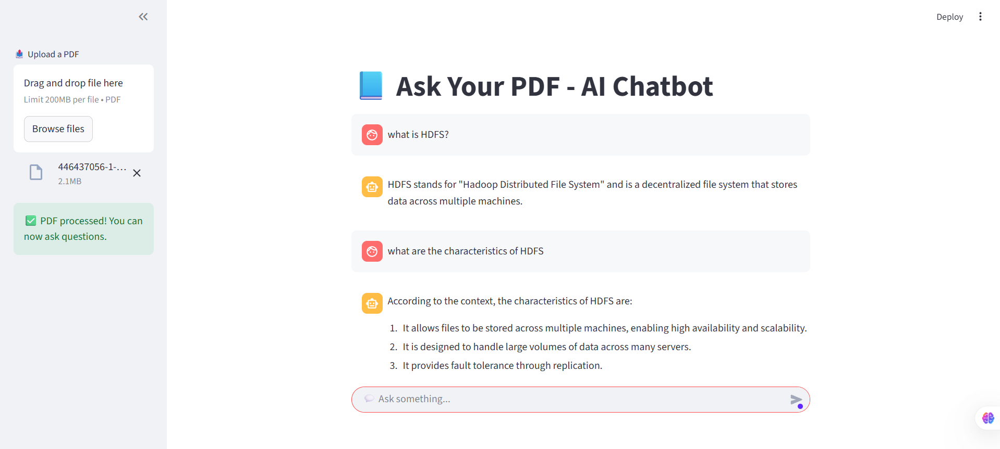
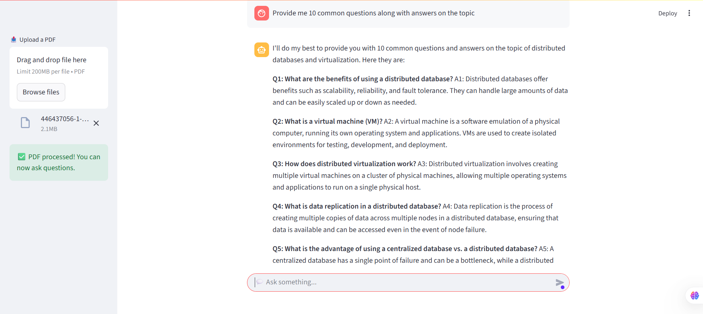

# AI Chatbot with GROQ, LangChain, RAG & PDF Support

This project is an AI-powered chatbot built with **Streamlit**, **LangChain**, **GROQ API**, and **Retrieval-Augmented Generation (RAG)** using **ChromaDB**.  
It allows users to:
- Ask general questions using GROQ-powered LLMs (like LLaMA 3, Mixtral)
- Upload PDFs and ask questions based on the document content (RAG)

---

## Tech Stack
Frontend: Streamlit

Backend Logic: Python, LangChain

Vector DB: ChromaDB

LLMs: GROQ API (llama3-8b-8192, mixtral-8x7b-32768, etc.)

PDF Processing: PyPDF, LangChain.text_splitter

## How to Use
Launch the app in your browser.

Ask any general question in the chat input — the LLM will respond using the GROQ API.

Upload one or more PDFs.

Ask questions like:

“What is the summary of this paper?”

“List the key findings.”

“Who are the authors and when was it published?”

## 🖼️ Screenshots

### 💬 Chat UI

### 📄 PDF Upload + RAG

